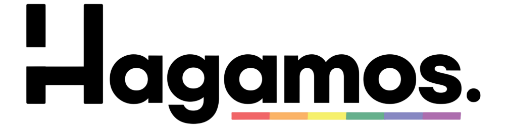
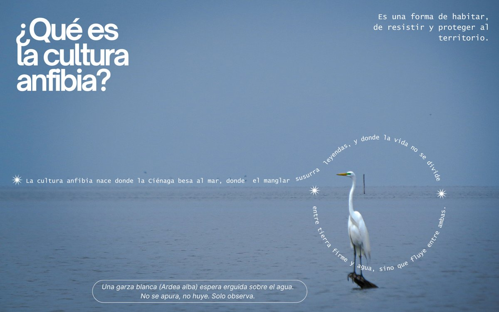
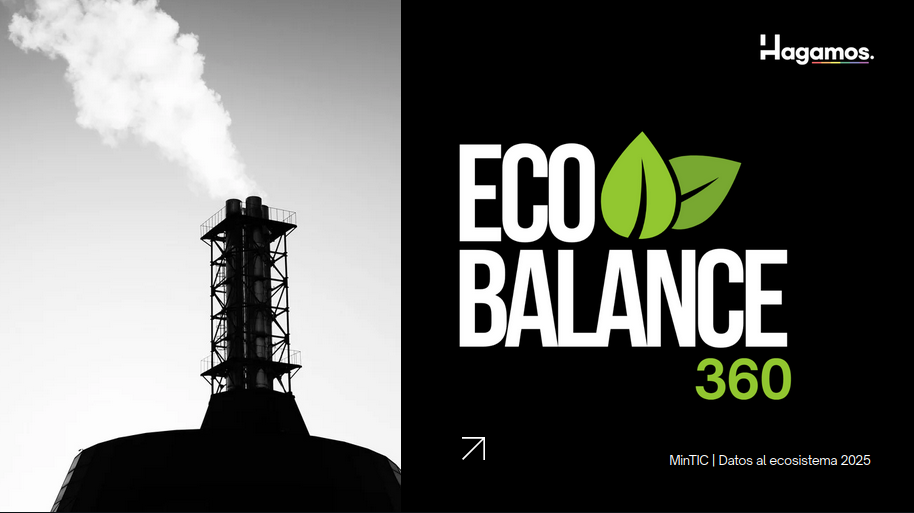
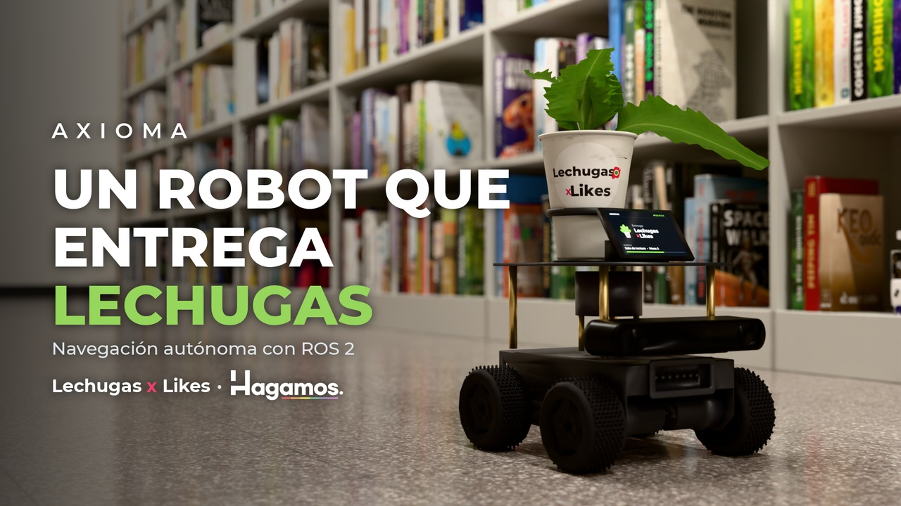
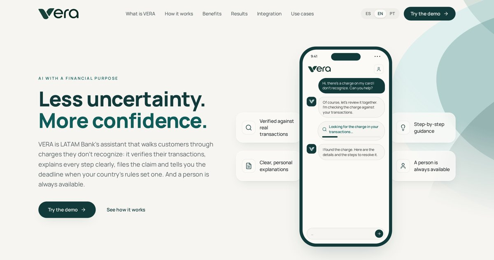

<picture>
  <source media="(prefers-color-scheme: dark)" srcset="img/logo-dark.png">
  
</picture>

 
 

**Un equipo multidisciplinario que promueve la identidad, la educación y el respeto por la diversidad y el ambiente.**

*A multidisciplinary team building technology for identity, education, diversity and the environment.*

 

---

## Proyectos

<table>
  <tr>
    <td width="45%">
      
    </td>
    <td>
      <h3><a href="https://github.com/ColectivoHagamos/CulturaAnfibia-AmphibiousCulture">Cultura Anfibia</a></h3>
      
Serie visual sobre la cultura que nace donde la Ciénaga se encuentra con el mar, inspirada en el concepto de Orlando Fals Borda. En español e inglés.

      

        
        
        
        
        
        
        
      

    </td>
  </tr>
  <tr>
    <td width="45%">
      
    </td>
    <td>
      <h3><a href="https://github.com/ColectivoHagamos/EcoBalance360-Mapa-Nacional-de-Captura-y-Emisiones-de-Carbono">EcoBalance360</a></h3>
      
Mapa de captura y emisiones de carbono para los 87 municipios de Santander, con metodología IPCC y datos abiertos. Incluye un simulador de escenarios, análisis con IA y juegos educativos para alcaldes, funcionarios y ciudadanía.

      
<b>Datos al Ecosistema 2025 · MinTIC</b>

      

        
        
        
        
      

    </td>
  </tr>
  <tr>
    <td width="45%">
      
    </td>
    <td>
      <h3><a href="https://github.com/ColectivoHagamos/Axioma_robot">Axioma</a></h3>
      
Robot móvil autónomo 4WD con ROS 2: mapea con SLAM, se localiza con AMCL y navega con Nav2 esquivando obstáculos. Se probó primero en una simulación en Gazebo y luego en el robot físico, con LiDAR 360° y cámara estéreo ZED 2i.

      
<b>Lechugas x Likes</b>

      

        
        
        
        
        
      

    </td>
  </tr>
  <tr>
    <td width="45%">
      
    </td>
    <td>
      <h3><a href="https://github.com/ColectivoHagamos/factored-hackathon-2026-hagamos">VERA</a></h3>
      
Asistente de disputas de tarjeta para LATAM Bank: verifica el cobro contra los registros, explica cada decisión con su regla y su fuente, registra el caso y siempre deja una persona disponible. En español y portugués.

      
<b>Factored AI &amp; Data Hackathon 2026</b>

      

        
        
        
        
      

    </td>
  </tr>
</table>
